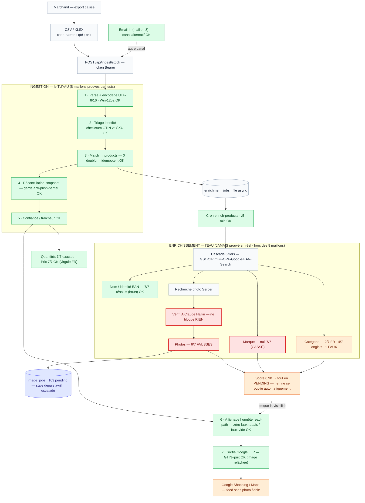

# Workflow ingestion stock + enrichissement — schéma & état réel (testé le 2026-06-27)

> Test de bout en bout : 7 vrais codes-barres poussés via `POST /api/ingest/stock` sur le
> marchand « Two-Step Test », enrichissement déclenché via le cron, **photos inspectées
> visuellement**. Ce doc distingue ce qui est **prouvé+vérifié** de ce qui est **cassé**.
> PNG rendu : `docs/workflow-ingestion-enrichment.png`.

## La distinction clé

Les 8 maillons « prouvés » du 22/06 = **le TUYAU** (intégrité de la donnée stock). Ils
ont tous tenu au test. L'**ENRICHISSEMENT** (EAN → photo/marque/catégorie) n'a **jamais**
fait partie de ces 8 maillons, n'a jamais été prouvé en réel, et était déjà **escaladé**
(image_jobs 103 pending depuis avril). C'est lui qui casse.

## Verdict par critère (test réel du 27/06)

| Critère | Verdict | Détail |
|---|---|---|
| Quantités | ✅ | 7/7 exactes |
| Prix | ✅ | 7/7 (virgule décimale FR → point) |
| Encodage CSV (Latin-1/accents) | ✅ | fallback Windows-1252 OK |
| Garde anti-push-partiel | ✅ | a protégé les 30 produits existants |
| Nom / identité EAN | ✅ | 7/7 résolus (mais bruts, non nettoyés) |
| Catégorie | ⚠️ | 2/7 mappés FR · 4/7 anglais · 1 faux (Coca→home&garden) |
| Marque | ❌ | null 7/7 |
| **Photos** | ❌ | **6/7 fausses** (colle→pantalon, BBQ→casque, scanner→Ray-Ban…) |
| Vérif IA photo (Haiku) | ❌ | ne rejette pas les images grossièrement fausses |
| Publication auto | ⚠️ | score 0,90 < 0,95 → tout reste en *pending* (revue manuelle) |

## Cause racine probable (à diagnostiquer)

1. **Recherche photo par EAN** : Serper renvoie du bruit (images de pages mentionnant des
   numéros proches). La requête par nom seule (marque=null) est faible.
2. **Vérif IA Haiku** : soit non appelée, soit **fail-open** (accepte sur erreur) → laisse
   passer une colle pour un pantalon. À confirmer dans le code (silent-failure).
3. Le 1 succès (Coca, EAN frais) venait d'un site mettant l'EAN dans le nom de fichier image.
